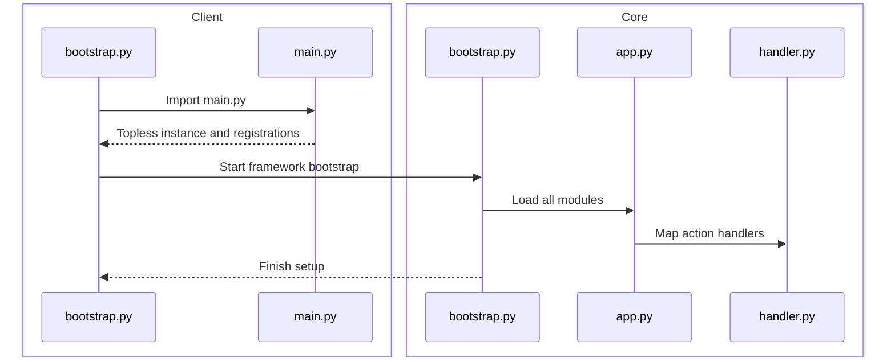
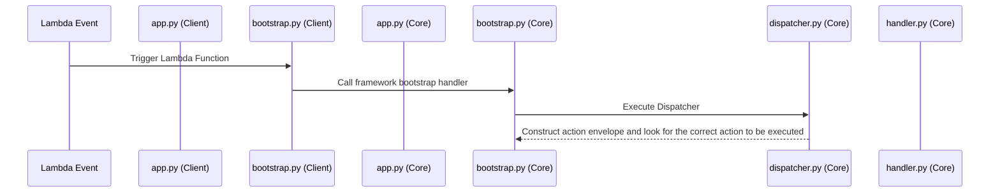

## Action Execution Model

The Topless actionexecution model is processed in two different steps:

1. Action Handler Registration
Every action created with one of the provided decorators (route, schedule, bucket or topic) is registered on the main Topless app instance. The instance is created on the client side (main.py file), and is shared throghouth the framework modules by a singleton pattern.

Flow of execution: 

2. Action Handler Execution
When lambda is called, the client bootstrap.py handle method is executed. Every lambda resource on the template.yaml (dinamically generated by topless framework), will call this method at first, which will dispatch the bootstrap.handle method, to localize the action handler that is needed on that call.

